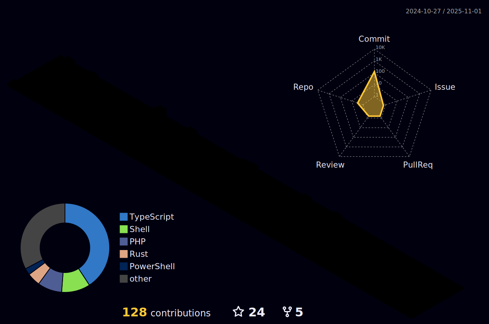

<h1 align="center">Hi 👋, I'm 玖堂恵</h1>

<h2 align="left">Stats:</h2>

  
   
  
   
  

<h2>3D Contrib:</h2>

  

    
  

<h2 align="left">Connect with me:</h2>

<h2 align="left">Support:</h2>

  

<h2 align="left">Motto:</h2>

> Make everything as simple as possible, but not simpler. -Albert Einstein

<!---
Angelmaneuver/Angelmaneuver is a ✨ special ✨ repository because its `README.md` (this file) appears on your GitHub profile.
You can click the Preview link to take a look at your changes.
--->
